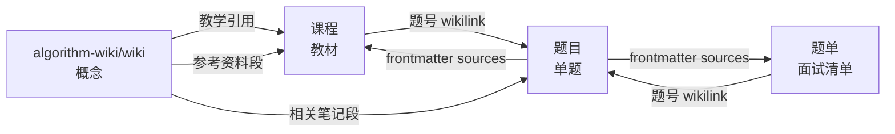

# 📘 算法仓库使用与维护 SOP

> **SOP = Standard Operating Procedure**。这份文档是你日常使用本仓库的**唯一参考**。
> 所有问题（"我现在该做什么 / 怎么做"）都能在这里找到答案。

---

## 目录

- [一、5 分钟看懂仓库](#一5-分钟看懂仓库)
- [二、日常使用（5 个场景）](#二日常使用5-个场景)
- [三、维护（按频率分）](#三维护按频率分)
- [四、添加新东西（4 种类型）](#四添加新东西4-种类型)
- [五、脚本完整速查](#五脚本完整速查)
- [六、故障排除（FAQ）](#六故障排除faq)
- [七、Prompt 库（10 个常用）](#七prompt-库10-个常用)
- [八、3 条铁律（必看）](#八3-条铁律必看)

---

## 一、5 分钟看懂仓库

### 五个轴

仓库按"**概念 + 来源 + 题单 + 题目 + 语言**" 五轴分类：

```text
左程云算法/                      ← Obsidian Vault 根
│
├── algorithm-wiki/              🧠 概念地图（55 篇短文，LLM 维护）
│   └── wiki/                       ↑ 入口：wiki/index.md
│
├── 课程/                        🎓 教材（按作者）—— 入口：先读这里
│   ├── 左程云/                     最大头（1700+ 文件）
│   ├── labuladong/                 9 主题（已拆单题，每文件成索引）
│   ├── 灵茶山艾府和代码随想录/     17 主题（已拆单题）
│   └── C++算法/                    13 文件
│
├── 题单/                        📋 面试题单
│   ├── Hot100.md / Blind75.md / Grind75.md / Leetcode150.md  ← 已拆为索引
│   └── 公司Tag/                    Meta / Google / Amazon / Apple / Microsoft / TikTok
│
├── 题目/                        📝 单题文件（370 道，按 LC 题号）
│   ├── 0001-两数之和.md             frontmatter 含来源 + tags + covers
│   ├── ...
│   ├── INDEX.md                    自动生成（按多种轴聚合）
│   └── DASHBOARD.md                Dataview 仪表板
│
├── 语言/                        🔧 C++ / Java / Python 参考 + 算法模板
│
├── README.md                    项目说明
└── SOP.md                       ← 你正在读
```

### 三种关系



**核心**：Obsidian wikilink 按 basename 解析，所以 `[[链表]]` `[[0042-接雨水]]` `[[bfs-dfs]]` **永远都能跳**，不管文件移到哪个目录。

---

## 二、日常使用（5 个场景）

### 场景 1：学一个新概念 / 主题

**典型动作**：今天想学 BFS。

| 步 | 操作 |
|---|---|
| 1 | 打开 `algorithm-wiki/wiki/algorithms/bfs-dfs.md` 看**概念 + 模板** |
| 2 | 滚到底部「📂 我 Vault 里的相关笔记」段，看灵神 / labuladong 都讲了什么 |
| 3 | 同时打开 `课程/labuladong/经典暴力搜索算法/BFS.md`（教材式讲解） |
| 4 | 滚到 `## 📑 题目索引` 看推荐刷哪些题 |
| 5 | 点任一 `[[0XXX-题名]]` 跳到具体题，看自己之前刷过没 |

**关键文件**：
- 概念入口：`algorithm-wiki/wiki/index.md`
- 全景图：`algorithm-wiki/wiki/maps/algorithm-overview.md`
- 学习路线：`algorithm-wiki/wiki/maps/dp-roadmap.md`

---

### 场景 2：刷新题（最高频）⭐

**全程在 Obsidian 里做笔记**——只有最后的"刷新索引"几个命令需要终端。

#### 一次性准备（5 分钟，做完一劳永逸）

1. 装 **Templater 插件**：Obsidian → Settings → Community plugins → 搜 `Templater` → 安装并启用
2. Settings → Templater → "Template folder location" 设为 `templates`
3. Settings → Templater → 给 "Insert template" 绑快捷键 `Cmd+Shift+T`

> 模板文件已放在 [`templates/题目模板.md`](templates/题目模板.md)。
> 完整说明（含字段意义、covers slug 全集）见 [`templates/README.md`](templates/README.md)。
> 不装 Templater 就用方式 B：手动复制粘贴模板。

#### 日常流程（在 Obsidian 里做）

```text
1. LeetCode AC 完
        ↓
2. Cmd+P 搜 "0752"
   → 已有 ✓ → 直接打开补充你的解法
   → 没有 ✗ → 走第 3 步
        ↓
3. 左栏 题目/ 文件夹上 右键 → New note
   → 命名：0752-打开转盘锁（4 位题号 + 中划线 + 题名）
        ↓
4. 按 Cmd+Shift+T → 选 "题目模板"
   → frontmatter + 骨架自动填入；date_solved 自动是今天
        ↓
5. 修 frontmatter 5 个字段：
   - leetcode: 752
   - title: 打开转盘锁
   - url: https://leetcode.cn/problems/open-the-lock/
   - difficulty: medium
   - tags: [bfs] / covers: [bfs-dfs]
        ↓
6. 写「思路」+ 粘 C++ 代码 + 写「易错点」
        ↓
7. Obsidian 自动保存，不用 Cmd+S
```

#### 已有的题怎么补充（不要覆盖原内容）

很多题（如 LC 752）拆题时已经从灵神/labuladong 那里拷过来一段：

```markdown
## 来源：labuladong / BFS

[labuladong 的笔记...]
```

**直接在文件末尾**追加你的（**不要**改原有「来源：xxx」段）：

```markdown
## 我的解法（2026-05-05）

[你的思路 + 代码]
```

这样既保留 labuladong 原讲解，又有你自己的版本对照。

#### 4 步收尾（终端里跑，每天结束一次即可）

打开 iTerm / Terminal：

```bash
algo                                                     # cd 到 vault（前提：你配了 alias，见第五节）
python algorithm-wiki/scripts/ingest.py 题目/0752-*.md   # 登记到 MEMORY.md
python algorithm-wiki/scripts/cross_link.py              # 刷新 wiki 末尾交叉链
python algorithm-wiki/scripts/build_index.py             # 重建 INDEX.md
python algorithm-wiki/scripts/lint.py                    # 体检
```

或者一行命令（如果你配了 alias）：

```bash
algo-daily   # build_index + lint + git commit + git push
```

---

### 场景 3：复习

**典型动作**：面试前 1 周，复习单调栈。

| 步 | 操作 |
|---|---|
| 1 | 打开 `algorithm-wiki/wiki/techniques/monotonic-stack.md` |
| 2 | 看「**经典模板**」段（C++ 代码） |
| 3 | 看「**经典题型**」表格 |
| 4 | 看「**📂 我 Vault 里的相关笔记**」段——按 LC 题号点过去复习 |
| 5 | 也可以打开 `题目/INDEX.md` → 「按主题」段 → `monotonic-stack` 段 |

---

### 场景 4：让 LLM 跨主题问答（杀手级用法）

**在 Claude Code / Cursor 里直接问，例如**：

```text
基于 algorithm-wiki/wiki/，请帮我对比 单调栈 vs 单调队列：
- 本质区别
- 各自适用场景（信号词）
- 各配 3 道代表题（优先列我 Vault 里做过的）
- 输出到 algorithm-wiki/outputs/reports/2026-MM-DD-monotonic.md
```

更多 Prompt 见 [七、Prompt 库](#七prompt-库10-个常用)。

---

### 场景 5：多教材对比阅读

**典型动作**：学 BFS 时看 3 家如何讲。

打开 Obsidian **三栏并列**：

```
┌─────────────────────┬─────────────────────┬─────────────────────┐
│ 概念视角            │ labuladong 视角     │ 灵神视角            │
│                     │                     │                     │
│ wiki/algorithms/    │ 课程/labuladong/    │ 课程/灵茶山艾府...  │
│ bfs-dfs.md          │ 经典暴力搜索算法/   │ 图.md               │
│                     │ BFS.md              │                     │
└─────────────────────┴─────────────────────┴─────────────────────┘
```

---

## 三、维护（按频率分）

### A. 每次刷完一题（30 秒）

```bash
git add 题目/0XXX-*
git commit -m "刷题：LC XXX 题名"
```

> 仓库有 vault backup 自动 commit 脚本，所以这步可以省，但养成习惯更好。

### B. 每天结束（3 分钟）

```bash
cd "/Users/ha/Documents/study/左程云算法"

# 刷新 INDEX（题数 +1，主题分布更新）
python algorithm-wiki/scripts/build_index.py

# 体检
python algorithm-wiki/scripts/lint.py

# 提交
git add -A && git commit -m "今日刷题 + 索引更新" && git push
```

### C. 每周日（15 分钟）

```bash
cd "/Users/ha/Documents/study/左程云算法"

# 1. 体检并写报告
python algorithm-wiki/scripts/lint.py --write-report
# 看 algorithm-wiki/outputs/reports/lint-yyyy-mm-dd.md

# 2. 刷新 wiki 末尾交叉链（如果新加了 题目/ 文件，wiki 概念应该也连上去）
python algorithm-wiki/scripts/cross_link.py

# 3. 重建 INDEX
python algorithm-wiki/scripts/build_index.py

# 4. 看本周新增多少题
python algorithm-wiki/scripts/fill_frontmatter.py --report  # 看哪些字段还空

# 5. 提交
git add -A && git commit -m "weekly maintenance" && git push
```

### D. 每月一次（30 分钟，可选）

```bash
# 1. 让 LLM 补 difficulty 字段（依然空的 LC 题）
# 在 Claude Code 里说：
# "请扫描 题目/ 下 difficulty 为空的题，根据 LC 题号查 LeetCode 官方难度，
#  把结果写到 algorithm-wiki/data/lc_difficulty.json，然后跑 fill_frontmatter.py"

# 2. 让 LLM 总结过去 30 天进度
# "请基于 题目/*.md 的 frontmatter date_solved 字段，给我做 5 月份做题统计"

# 3. 让 LLM 找薄弱主题
# "题目/INDEX.md 里哪些主题题数最少？这是我的薄弱区，给我推荐补什么题"
```

---

## 四、添加新东西（4 种类型）

### A. 新刷一道题（每天都做） → 见 [场景 2](#场景-2刷新题最高频-)

### B. 新一篇外部博客 / 教材

**全程在浏览器 + Obsidian 里完成**，最后一步用终端跑 ingest。

#### 路径 A：用 Obsidian Web Clipper（推荐）

```text
1. 浏览器装 Obsidian Web Clipper 扩展（Chrome / Firefox / Edge 都有）
   → Obsidian 设置里把目标 vault 设为「左程云算法」
   → 把保存目录设为 algorithm-wiki/raw/articles/

2. 浏览器：在你想保存的网页上按 Web Clipper 快捷键
   → 自动落到 algorithm-wiki/raw/articles/yyyy-mm-dd-标题.md
   → 自动带上 source URL 等 frontmatter

3. Obsidian：打开 Cmd+P 搜文件名 → 看一下抓的内容完整不完整
   → 必要时手动补 frontmatter 字段（如 captured 日期）
```

#### 路径 B：手抄笔记（短内容用）

```text
1. Obsidian：左栏 algorithm-wiki/raw/articles/ 上 右键 → New note
2. 命名：yyyy-mm-dd-作者-标题
3. 顶部粘 frontmatter：
   ---
   source: https://...
   captured: 2026-05-05
   tags: [...]
   ---
4. 复制内容粘进去
```

#### 之后（终端 + Claude Code）

```bash
# 登记到 MEMORY.md
algo
python algorithm-wiki/scripts/ingest.py "algorithm-wiki/raw/articles/yyyy-mm-dd-xxx.md"
```

然后在 **Claude Code 里**粘 [Prompt 2](#2-把外部素材编译进-wiki) 让 LLM 编译进 wiki。

---

### C. 新一家公司 tag

**全程在 Obsidian 里**——不需要终端。

```text
1. 左栏 题单/公司Tag/ 上 右键 → New folder → 命名 "Stripe"
        ↓
2. 选中 Stripe/ → 右键 → New note → 命名 "README"
        ↓
3. 粘进下面这段（按 Cmd+V）：
```

```yaml
---
company: Stripe
priority: medium
updated: 2026-05-05
---

# Stripe 面试题

## 面试特点
- 偏后端 + 系统设计 + 一些算法
- 重视代码质量和测试
- 注重代码风格 + 测试

## 题目
> 用 [Prompt 1](#1-把新题链入-wiki) 让 LLM 把刷过的 Stripe 题登记到这里

## 关联
- [`../README.md`](../README.md)
```

```text
4. Cmd+P 打开 题单/公司Tag/README.md
        ↓
5. 在「计划新增」或「已有公司」表加一行 Stripe
```

> 也可以直接复制现成的 `题单/公司Tag/Apple/README.md` 改改字段——更省事。

---

### D. 新一个算法模板

模板有两种格式可选：

#### D1. **Markdown 模板**（推荐，在 Obsidian 里写）

适合：带说明文字 + 代码片段 + 测试题号

```text
1. 左栏 语言/C++/算法模板/ 上 右键 → New folder → 命名 "数据结构"
        ↓
2. 选中 数据结构/ → 右键 → New note → 命名 "单调栈"
        ↓
3. 粘进模板内容（见下）→ Obsidian 自动保存
```

**模板内容**（Obsidian 里复制粘贴）：

````markdown
---
template: monotonic-stack
language: C++
covers: [monotonic-stack, stack]
test_problems: [LC 496, LC 503, LC 739, LC 901]
---

# 单调栈

> 求每个元素右侧第一个更大元素
> 复杂度：时间 O(N)，空间 O(N)

## 适用

见 [[monotonic-stack]]

## 代码

```cpp
#include <vector>
#include <stack>
using namespace std;

vector<int> nextGreater(vector<int>& nums) {
    int n = nums.size();
    vector<int> ans(n, -1);
    stack<int> st;
    for (int i = 0; i < n; ++i) {
        while (!st.empty() && nums[i] > nums[st.top()]) {
            ans[st.top()] = i;
            st.pop();
        }
        st.push(i);
    }
    return ans;
}
```

## 测试题

- [[0496-下一个更大元素 I]]
- [[0503-下一个更大元素 II]]
- [[0739-每日温度]]
````

#### D2. **纯 .cpp 模板**（直接能编译跑）

Obsidian 默认不渲染 `.cpp`，但能创建。**更顺手的做法**：

```text
1. 在 VS Code / Cursor 里打开仓库
2. 在 语言/C++/算法模板/数据结构/ 下 New file → "单调栈.cpp"
3. 写代码（顶部用块注释写说明 + 测试题号）
```

写完后 Obsidian 也能看到这个文件（只是不渲染高亮），git 一样跟踪。

---

## 五、脚本完整速查

| 命令 | 用途 | 何时跑 |
|---|---|---|
| `python algorithm-wiki/scripts/ingest.py <path>` | 登记新素材到 MEMORY.md | 新增 raw/ 或 题目/ 文件后 |
| `python algorithm-wiki/scripts/search.py "关键词"` | 全文搜索 wiki | 想找资料时 |
| `python algorithm-wiki/scripts/search.py "关键词" --include-raw --json` | 加 raw/ + JSON（给 LLM） | LLM 调用 |
| `python algorithm-wiki/scripts/lint.py` | 体检：断链 / 孤立 / 缺 frontmatter | 每周 / 大改后 |
| `python algorithm-wiki/scripts/lint.py --write-report` | 体检 + 写报告 | 同上 |
| `python algorithm-wiki/scripts/cross_link.py` | 刷新 wiki 末尾的 Vault 交叉链 | 课程/题目/ 新增后 |
| `python algorithm-wiki/scripts/split_topic.py <topic.md>` | 拆主题文件成单题 | 新教材入库后（可选） |
| `python algorithm-wiki/scripts/split_topic.py --dry-run <topic.md>` | 拆分预演 | 拆前先看效果 |
| `python algorithm-wiki/scripts/fill_frontmatter.py` | 批量补 difficulty/tags/covers | 拆完题或批量入库后 |
| `python algorithm-wiki/scripts/fill_frontmatter.py --report` | 看哪些 frontmatter 字段还空 | 维护时 |
| `python algorithm-wiki/scripts/build_index.py` | 重建 题目/INDEX.md + DASHBOARD.md | 题目 +1 后 |
| `python algorithm-wiki/scripts/compile.py <raw_path>` | 生成 LLM 编译素材的 prompt | 给非 Claude Code 的 LLM |

### Mac alias（`~/.zshrc` 加这个）

```bash
alias algo='cd "/Users/ha/Documents/study/左程云算法"'
alias algo-lint='cd "/Users/ha/Documents/study/左程云算法" && python3 algorithm-wiki/scripts/lint.py'
alias algo-link='cd "/Users/ha/Documents/study/左程云算法" && python3 algorithm-wiki/scripts/cross_link.py'
alias algo-index='cd "/Users/ha/Documents/study/左程云算法" && python3 algorithm-wiki/scripts/build_index.py'
alias algo-search='python3 "/Users/ha/Documents/study/左程云算法/algorithm-wiki/scripts/search.py"'
alias algo-fill='cd "/Users/ha/Documents/study/左程云算法" && python3 algorithm-wiki/scripts/fill_frontmatter.py'

# 一键日常维护
alias algo-daily='cd "/Users/ha/Documents/study/左程云算法" && \
    python3 algorithm-wiki/scripts/build_index.py && \
    python3 algorithm-wiki/scripts/lint.py && \
    git add -A && git commit -m "daily" && git push'
```

之后日常一行命令：`algo-daily`

---

## 六、故障排除（FAQ）

### Q1：lint 报"断链"

```bash
python algorithm-wiki/scripts/lint.py --write-report
# 看报告，找到具体断链文件
# 大概率是某个 wiki 文件用了不存在的 [[xxx]] 链接
# 修法：删掉那个 link 或者新建对应文件
```

### Q2：cross_link 找不到我的新题

`cross_link.py` 通过**关键词匹配文件名**联到 wiki。如果你的题目文件名不含主题关键字（如 `0XXX-XXX.md` 不带"链表"），就不会被链上。

修法：
- 让题目文件名稍微表明主题
- 或者在 `algorithm-wiki/scripts/cross_link.py` 的 `ARTICLES` dict 里加更多关键词

### Q3：题目/0XXX 和 题目/0YYY 是同一道题

跑去重检查：

```bash
python3 -c "
from pathlib import Path
import re
from collections import defaultdict
P = Path('题目')
FM = re.compile(r'^---\n(.*?)\n---\n', re.DOTALL)
by_lc = defaultdict(list)
for f in sorted(P.glob('*.md')):
    if f.name in {'INDEX.md', 'DASHBOARD.md', 'README.md'}: continue
    m = FM.match(f.read_text(encoding='utf-8'))
    if not m: continue
    lc = re.search(r'^leetcode:\s*(\d+)', m.group(1), re.MULTILINE)
    if lc: by_lc[int(lc.group(1))].append(f.name)
print({k:v for k,v in by_lc.items() if len(v)>1})
"
```

如果找到重复，**保留中文规范名**那个，把另一个的 sources 合并过去再删除。

### Q4：git status 一片混乱 / 不知道改了啥

```bash
git status -s | head -30
git diff --stat | tail -10
```

如果想完全回滚到 origin：

```bash
git fetch
git reset --hard origin/main   # ⚠️ 丢弃本地未推送的修改
```

### Q5：拆主题文件后，原 wikilink 找不到了

Obsidian 按 basename 解析。如果旧链接是 `[[反转链表]]` 而拆出来的文件叫 `0206-反转链表.md`——basename 不一样，**会断**。

修法：
- 在拆出来的题目文件 frontmatter 加 alias：
  ```yaml
  aliases: [反转链表]
  ```
  Obsidian 就能通过 alias 解析。

### Q6：题号错配（卡码 / 牛客等其他平台编号撞 LC）

把 frontmatter 的 `leetcode: XX` 改成 `kama: XX` 或 `nowcoder: XX`，文件名前缀也改成 `卡码-XX-题名.md`。

---

## 七、Prompt 库（10 个常用）

> 在 Claude Code / Cursor 里**直接复制粘贴**，按需替换 `{占位符}`。

### 1. 把新题链入 wiki

```text
我刚做完 LC {题号}（{题名}），写到 题目/{文件名}.md。
请按 algorithm-wiki/WORKFLOW.md：
1. 看 frontmatter 的 covers 字段
2. 在 algorithm-wiki/wiki/ 中找到对应概念文章
3. 在「经典题型」表里加这道题
4. 给我简短报告
```

### 2. 把外部素材编译进 wiki

```text
请按 algorithm-wiki/WORKFLOW.md 的 ingest 协议，
把 algorithm-wiki/raw/articles/{文件名}.md 编译进 wiki：
1. 识别 2~10 个相关概念
2. 已有概念追加新事实
3. 应当新建的概念用模板新建
4. 完成后给报告
```

### 3. 跨主题对比

```text
基于 algorithm-wiki/wiki/，请帮我对比 {主题A} vs {主题B}：
- 本质区别
- 各自适用场景（信号词）
- 各配 3 道代表题（优先列我 Vault 里做过的）
- 输出到 algorithm-wiki/outputs/reports/2026-MM-DD-{topic}.md
```

经典对比：
- 单调栈 vs 单调队列
- 回溯 vs DP
- BFS vs DFS
- 二分查找 vs 二分答案
- 0-1 背包 vs 完全背包

### 4. 出复习路线

```text
我距离面试还有 {N} 天，目标公司 {公司}，弱项 {弱项}。
请基于 algorithm-wiki/wiki/maps/algorithm-overview.md 和 题目/INDEX.md，
给我出一份：
- 每天 1-3 道题
- 涵盖薄弱概念
- 按"概念 → 模板 → 经典题 → 变种"顺序
- 优先复习我已做过但 retry_needed=true 的题
输出到 algorithm-wiki/outputs/reports/2026-MM-DD-{N}day-plan.md
```

### 5. 综述某主题

```text
请基于 algorithm-wiki/wiki/ + 课程/ 综合，
给我写一份「{主题}全景综述」：
- 概念 + 模板 + 复杂度
- 信号词
- 5 道由易到难的代表题（优先用我 Vault 里的）
- 易错点 + 面试加分点
输出到 algorithm-wiki/outputs/reports/2026-MM-DD-{主题}-survey.md
```

### 6. 出模拟题

```text
请基于 algorithm-wiki 给我出 {N} 道结合 {概念A} + {概念B} 的
{难度} 难度面试题：
- 题目原创但风格类似 LeetCode
- 给测试用例
- 不要给答案（先让我自己做）
输出到 algorithm-wiki/outputs/reports/2026-MM-DD-mock-{topic}.md
```

### 7. 体检并修复

```text
请：
1. 跑 python algorithm-wiki/scripts/lint.py --write-report
2. 看报告
3. 自动修复"明显问题"（缺 frontmatter / 笔误的断链 / 孤立条目）
4. "不明显问题"列出来征求我意见
```

### 8. 补 difficulty 字段

```text
请扫描 题目/ 下 frontmatter 中 difficulty 为空的题目，
对每个 LC 题号查 LeetCode 官方难度（用 web search 如果不确定），
把结果写到 algorithm-wiki/data/lc_difficulty.json，
最后跑 python algorithm-wiki/scripts/fill_frontmatter.py 应用。
```

### 9. 补 tags / covers 字段

```text
请扫描 题目/ 下 tags 或 covers 为空的题目，
读题目内容（题名 + 解法），推断它涉及的概念，
直接写到对应 frontmatter（tags 用一般化术语，covers 用 algorithm-wiki/wiki/ 里存在的 slug）。
完成后跑 build_index.py 更新索引。
```

### 10. 找出我"久不复习"的题

```text
请扫描 题目/*.md 的 frontmatter，找出：
- 没有 last_reviewed 字段（从未复习过）
- 或者 last_reviewed 距今超过 30 天
按 difficulty hard > medium > easy 排序，
给我列表（前 30 道），用作下周复习清单。
```

---

## 八、3 条铁律（必看）

### 1️⃣ wiki/ 是 LLM 的领地，你不要手写

**为什么**：wiki 内容是 LLM 通过 ingest / cross_link 等流程**自动维护**的。你手改了，下次 LLM 改的时候可能覆盖你的。

**正确做法**：要加内容 → 让 LLM 改、或写到 `outputs/reports/`、再让 LLM 回流。

### 2️⃣ 课程/ 里大文件被拆过的不要再加内容

**已拆的主题文件**（如 `课程/灵茶山艾府和代码随想录/链表.md` `课程/labuladong/经典暴力搜索算法/BFS.md`）现在是**索引**——直接编辑会和 split_topic 的逻辑冲突。

**正确做法**：要补充某道题的内容 → 直接编辑 `题目/0XXX-题名.md`（在「## 来源：xxx」段下加新解法即可）。

### 3️⃣ git 是安全网

每次大改前：

```bash
git status                      # 看一眼当前状态
git stash                       # 暂存当前修改
git log --oneline -10           # 看最近提交
```

想回滚某个文件：

```bash
git checkout HEAD -- 题目/0XXX-题名.md
```

完全乱了：

```bash
git fetch && git reset --hard origin/main   # ⚠️ 会丢本地未推送的修改
```

---

## 附：当前仓库快照（2026-05-05）

| 项 | 数 |
|---|---|
| 题目/ 总数 | 370 |
| difficulty 已填 | ~317 题（85%） |
| tags 已填 | ~340 题（92%） |
| 多源题（≥3 来源） | 80+ |
| algorithm-wiki/wiki/ 文章 | 55 |
| 总字数 | ~85 万 |
| 来源 | 27 个（17 灵神 + 9 labuladong + 4 题单 + ...） |
| Lint 状态 | 0 断链 / 0 孤立 |

---

**祝刷题顺利、面试通过 🚀**

> 这份 SOP 当你忘了流程时回来翻就是。把它**钉在 Obsidian 侧栏**最方便。
