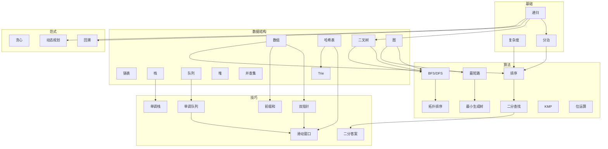

# 算法学习全景图

> 一张 mermaid 把整个 Wiki 的核心概念串起来。
> 每个节点对应一个 `wiki/` 下的具体条目。

## 阅读建议

- **零基础**：先 `基础` → `数据结构` 主干（数组 / 链表 / 栈队列 / 哈希 / 树）→ `算法` 主干（排序 / 二分 / DFS / BFS）
- **冲刺面试**：补 `技巧` 全部 + `范式` 中的回溯 + DP 入门 → 然后做 [[../../题单/Hot100|Hot100]]
- **进阶**：`算法` 的 [[shortest-path]] / [[kmp]] / [[manacher]] + `范式` 的 [[dp-knapsack]] / [[dp-tree]] / [[dp-bitmask]]

## 与刷题路线的关系

本图按"概念依赖"组织。如果你想要"按题号刷"，请使用：

- [[../../题单/Hot100|LeetCode Hot 100]]
- [[../../题单/Blind75|Blind 75]]
- [[../../题单/Grind75|Grind 75]]
- [[../../题单/Leetcode150|LC Top Interview 150]]

或者按**专题**刷：
- [[../../课程/灵茶山艾府 + 代码随想录/动态规划|代码随想录 DP]]
- [[../../课程/灵茶山艾府 + 代码随想录/二叉树|代码随想录 二叉树]]

本 Wiki 提供"概念入口"，刷题笔记在 Vault 别的位置。

## 相关地图

- [[ds-overview]] — 只看数据结构
- [[dp-roadmap]] — 只看 DP
