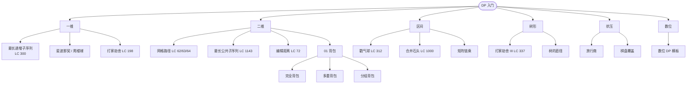

# DP 学习路线

> 动态规划是面试与算法竞赛的"分水岭"。这张图按**状态空间维度**和**典型题型**组织。



## 学习顺序（推荐）

1. **入门**：[[dp]] 总论 → 斐波那契 → 爬楼梯 → 打家劫舍
2. **一维**：[[problems/lis|最长递增子序列]] → 最长摆动子序列 → 单词拆分
3. **二维（双串）**：[[problems/edit-distance|编辑距离]] → LCS → 通配符匹配
4. **二维（网格）**：不同路径 → 最小路径和 → 三角形最小路径
5. **背包**：[[dp-knapsack]] 01 → 完全 → 多重 → 分组
6. **区间**：[[dp-interval]] 戳气球 → 合并石头
7. **树形**：[[dp-tree]] 打家劫舍 III → 树的直径
8. **状压**：[[dp-bitmask]] 旅行商 → 棋盘覆盖
9. **数位**：[[dp-digit]] Windy 数 / 不含连续 1 的二进制数

## 通用框架（5 步法）

每道 DP 题按这 5 步走：

```text
1. 定义状态 dp[…] 是什么"含义"（最关键）
2. 初始状态 dp[0]、dp[起点] 等的边界值
3. 状态转移方程：dp[i] = f(dp[i-1], …)
4. 遍历顺序：保证依赖项已经算出
5. 返回值：dp[n] 还是 max(dp)？
```

详见 [[dp]] 一文。

## 与你 Vault 中现有笔记的对应

- [[../../课程/灵茶山艾府 + 代码随想录/动态规划]] — 代码随想录 DP 题单（按题型）
- [[../../课程/左程云/200. ★算法题目汇总★]] — 左程云课程 DP 章节
- [[../../题单/Hot100|Hot100]] 中所有标 `[DP]` 的题

## 相关地图

- [[algorithm-overview]] — 全景
- [[ds-overview]] — 数据结构
