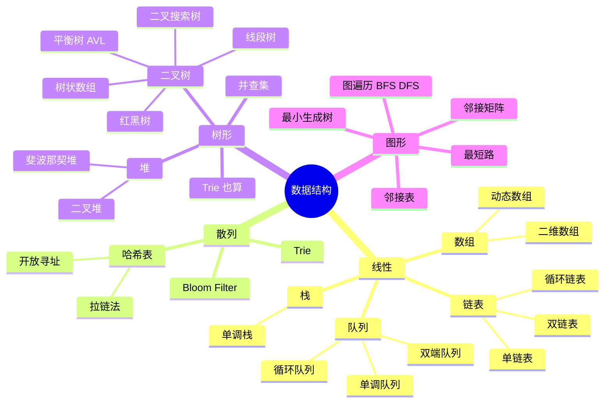

# 数据结构全景

> 把数据结构按"线性 / 树形 / 图形 / 散列"分四类展开。

## 选型速查表

| 场景 | 优先选 | 理由 |
|---|---|---|
| 已知大小、随机访问 | [[array]] | O(1) 访问 |
| 频繁插入删除中间 | [[linked-list]] | O(1) 插删（已有指针） |
| 后进先出 / 嵌套结构 | [[stack]] | 自然匹配递归调用栈 |
| 先进先出 / BFS | [[queue]] | 层序处理 |
| 滑窗内最值 | [[monotonic-queue]] | O(1) 摊销 |
| Top-K | [[heap]] | O(N log K) |
| 区间最值 | [[segment-tree]] | O(log N) 查询 |
| 区间和 / 单点修改 | [[fenwick-tree]] | 实现简单 |
| 集合合并 + 连通性 | [[union-find]] | 近 O(α(N)) |
| 字符串前缀检索 | [[trie]] | O(L) 查询 |
| 计数 / 去重 / 映射 | [[hash-table]] | 平均 O(1) |
| 关系 / 路径 / 网络 | [[graph]] | 拓扑、最短路、连通性 |

## 复杂度对照

| 数据结构 | 访问 | 插入 | 删除 | 查找 |
|---|---|---|---|---|
| 数组 | O(1) | O(N) | O(N) | O(N) |
| 链表 | O(N) | O(1)\* | O(1)\* | O(N) |
| 栈 / 队列 | — | O(1) | O(1) | — |
| 哈希表 | — | O(1) avg | O(1) avg | O(1) avg |
| 二叉搜索树（平衡） | O(log N) | O(log N) | O(log N) | O(log N) |
| 堆 | O(1) (top) | O(log N) | O(log N) | — |
| 并查集 | — | — | — | ~O(α(N)) |
| Trie | O(L) | O(L) | O(L) | O(L) |

\* 链表的 O(1) 插删是"已经持有目标节点指针"的前提下；找到节点本身是 O(N)。

## 相关地图

- [[algorithm-overview]] — 全景
- [[dp-roadmap]] — DP 路线
